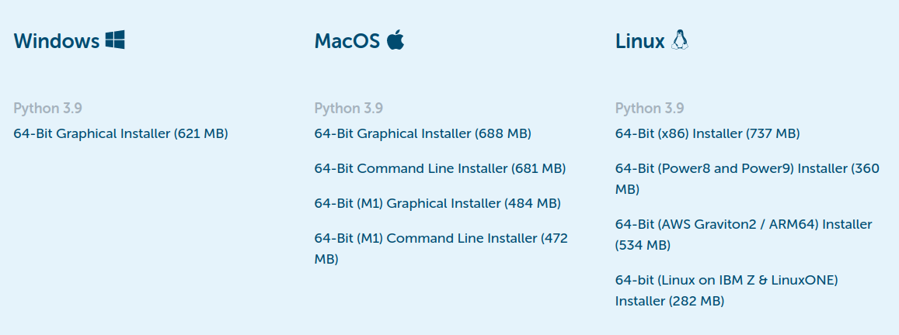

Installing Python
=================

**In order to complete the tutorials and exercises, you should download a python distribution on your own computer.**  While the Mac computers in the campus computer labs have python installed on them, these versions may not have some of the packages that we will use in this course. The purpose of this page is to help you to
install Python and different Python packages onto your own computer. While it is possible to install Python from the Python homepage https://www.python.org/,
**we highly recommend using** `Anaconda <https://www.anaconda.com/download/>`_ which is an open source distribution of the Python and R programming
languages for large-scale data processing and scientific computing. Anaconda combines a basic python distribution with many packages that are commonly used to do science. This makes life a lot easier for us, the users, in the
long run.

Downloading Anaconda
--------------------

To download the installer, head to the
`Anaconda Individual Edition page <https://www.anaconda.com/products/individual>`_.
Once there, click the **Download** button to be shown the different
installer options.

    Anaconda Installer Options.  You probably want the graphical option, but you do you.

The Installer that you select will depend on your operating system and
system architecture. If you are unsure, most systems use 64-bit these
days.

Install Anaconda to your computer by double clicking the installer and install it into a directory you want (you will need admin privileges).
If promped, install it to **all users** and use default settings.

Testing the install: Windows
----------------------------

Test that Anaconda´s *package manager* called ``conda`` works by
opening a command prompt as a admin user (http://www.howtogeek.com/194041/how-to-open-the-command-prompt-as-administrator-in-windows-8.1/)
and running the command ``conda --version``. If the command returns a version number of conda (e.g. ``conda 4.5.9``) everything is working correctly.

Testing the install: Mac
------------------------

On a Mac, open up the Terminal application (Applications - Utilities - Terminal) and enter ``conda --version`` to
verify a correct installation.

.. note:: The ``conda`` command in the Windows Command Prompt or
          Mac Terminal can be used to install
          packages that
          were not included with the base distribution, though we probably
          won't need to do that in this course.

Updating
--------

Once you start using Anaconda or the Spyder IDE, you
may get the occasional "software needs updating" dialog
box popping up. Updating is easy from the Command prompt
(windows) or Terminal (Mac). Simply execute the command
``conda update spyder`` and follow the instructions.
