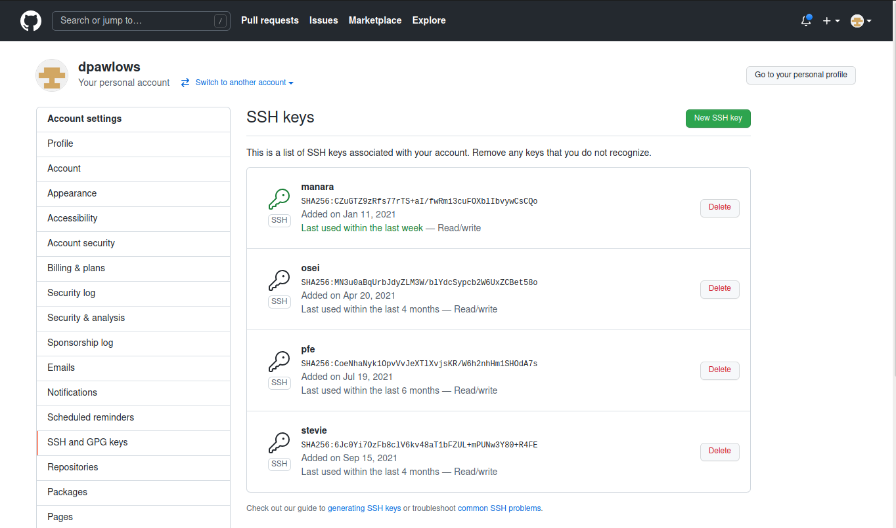
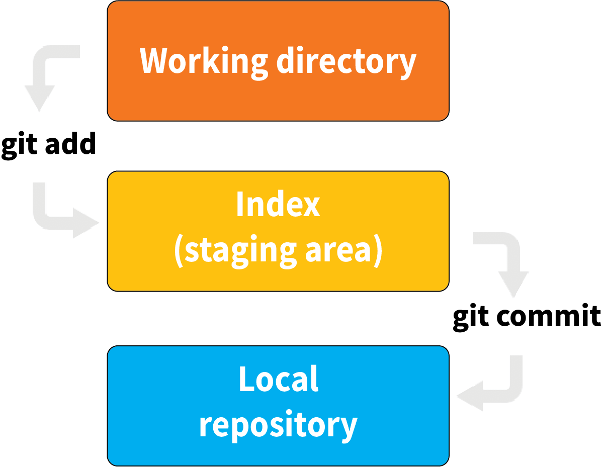
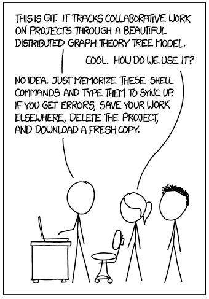

Good coding practices- Version control with git
===============================================

For this week's good coding practices, the focus
is on maintaining and keeping track of changes
to your software as it evolves, also known as **version
control**. As you may have already discovered on your
own, the process of writing software is one of
write and revise, write and revise, repeat. As our
software becomes more complex, it becomes easier to make
changes to our code that cause unexpected issues,
in many cases without being aware that we've even
introduced such issues. Being able to go back and
look at a previous version of our software so that
we can fix such issues is paramount.

Additionally, when we work collaboratively on a project,
it is important to have a robust system that keeps track
of the changes that others make to software that is
used by the group. Otherwise it is difficult to
know what changes were made and easy to make mistakes
like overwrite updates to the code!
Simply put, keeping track of the changes that we make ourselves
or those that others make is an important part of programming
efficiently and effectively.

Git
---

As software development practices have evolved, so have
version control systems (VCS). One of the
most popular VCSs today is called git. Git handles
tracking changes made to files in a simple way,
without necessitating additional software to be installed
to each of your projects. Git handles all this by
essentially taking a snapshot of your entire project
each time you commit a change. In this way, a git "commit" (an
individual snapshot) acts
kind of like a miniature file system. This means that
there are some really useful tools that make developing
software very efficient and safe, making it
difficult to destroy or lose code.

If you have completed some of the previous exercises
in this course, you have used git without really
doing anything other than pressing an upload button or
two. Now we will learn to use git as part of
our normal workflow as part of working with Anaconda.

.. Installation
.. ^^^^^^^^^^^^

.. The computer that you are working on will determine how you install git. If you are 
.. on Windows, please open the `Powershell program <https://learn.microsoft.com/en-us/powershell/scripting/overview?view=powershell-7.3>`_.
.. (this is an application that is already installed on your computer).
.. On Mac, open the `Terminal <https://en.wikipedia.org/wiki/Terminal_(macOS)>`_
.. program. Both to these programs give you access to a 
.. `Terminal Emulator <https://en.wikipedia.org/wiki/Terminal_emulator>`_, 
.. which is a way to interact with your computer via the keyboard.

Installation using Anaconda
^^^^^^^^^^^^^^^^^^^^^^^^^^^

So, start Anaconda up as you normally would, but **don't** start a Spyder
session. Instead, once the Navigator is open,
launch a JupyterLab session. Once you click the
Launch button, you might be prompted to choose
a program with which to start a JupyerLab session.
Choose your favorite web browser.

.. figure:: images/jupyterlab.png
    :width: 600px
    :align: center
    :alt: jupyter lab session

    A JupyterLab session

We will talk more about using JupyterLab in a future
lesson, but here we will use it to access
the **Terminal**. You should see the Terminal icon
in your JupyterLab startup under the "other" heading.
If not, you can click on ``file`` then ``new`` then ``Terminal``.

.. figure:: images/terminal.png
    :width: 600px
    :align: center
    :alt: terminal

    I use a mac, so my terminal might look a little
    different. On Windows, it will probably say
    something like "using Powershell".

This will start a terminal session within JupyterLab
itself. We will use Terminal through out this
lesson, as well as in future lessons,
so remember how to access this application.

Installing Git
^^^^^^^^^^^^^^

The terminal will behave differently
depending if you are on a Windows computer or a Mac,
but the command that we will use to install
git is the same regardless. In the terminal enter
the following command:

::

  conda install -c anaconda git

You will probably be told that various things need updating,
and then prompted to enter whether to proceed or not.
Enter 'y' and git (and some other updates) will
be installed.

.. warning::
  If you are having issues installing git
  ..  or working with the Powershell or the Terminal 
  (or anything else), please let me know so we can talk about it and fix the issue. 
  I would like you to use git as outlined in this lesson for the rest of the course, so 
  let's make sure things are setup correctly now!  
  .. There is a lot 
  .. you can do with a terminal emulator but we aren't covering any of that in this course (wait until 
  .. Phy380), but I do want you to use it to work with git and github.

.. _using_git:

Using git
*********

In this course, we will use git to

1. **Clone** (download) code from your remote repositories on GitHub.
2. **Commit** changes to your code on your local computer
   to maintain a history of the progress of your programs.
3. **Push** (upload) your commits back to the remote repository so
   they can be accessed from any other computer
   (and by me).

We will do these things by entering specific commands
in the terminal (via Powershell on Windows or Terminal on Mac).

But first! A point of clarification: The entire purpose of git
is to handle keeping track of your code's history. Every time you make a **commit**
the code as it exists at that point will be saved. This means that you never have to
save multiple versions of your code using different filenames: e.g. mycode_v1.py,
mycode_v2.py, mycode_v2a.py, etc. If you are at a point that you made changes to your
code and you want to make sure they are tracked, you simply need to
make a commit following the instructions below.

Now let's learn the git basics.

Linking your computer to GitHub
^^^^^^^^^^^^^^^^^^^^^^^^^^^^^^^
Recently, GitHub changed the way that you can access your remote repositories. They
now require the use of something called an **SSH Key** to allow uploading of
your commits directly from your computer to your remote repo. So, we need to set
that up.

In short, an SSH Key is a more secure replacement for a traditional username and password.
On your local computer, you can create an ssh key pair. One of the pairs is
called a private key, which is something that you keep on your local computer and
**never, ever** share with anyone else, or any other computer. The other
part of the pair is called the public key. This can be shared with anyone, and in
this case, GitHub.

The way it works is this. The GitHub will have your public key, which includes
information about your local computer, so that when you attempt to push
code to GitHub from that computer, GitHub will recognize it and present it
with your public key. Your public key is an encrypted message that can only
be unencrypted by someone that has the corresponding private key. When you
send code to GitHub, your computer will decrypt the public key and
show GitHub the result, at which point GitHub will more or less say "yes, you are the
person (computer) that is allowed access to this account on GitHub. Proceed..."

To summarize, the steps that you need to complete are:

1. Create an ssh key pair on your local computer.
2. Share you ssh **public** key with GitHub.

The process for doing this is pretty simple.... if you know what you are doing.
As a starting point, see if you can follow the instructions here:
https://docs.github.com/en/authentication/connecting-to-github-with-ssh

.. note::
  For Windows users- in the instructions, you are told to "Open Git Bash". Instead, you should
  use the **Terminal** like you did above when installing git.

  When following the linked instructions, on the page called "Generate new SSH key",
  you should ignore the section titled "Generating a new SSH key for a hardware security key".
  Also, when generating a SSH key, you will be asked for a passphrase. It is (somewhat) acceptable
  to leave your passphrase as blank. As long as no one else gets your private key!

I fully expect to work with many, or all, of you individually to help
troubleshoot, so please don't get frustrated by this process and reach out
to me for help if you get stuck!

Once you have an SSH key installed, you should see it in the list on GitHub.

    I currently have 4 public keys, which correspond to 4 different computers
    that can access my GitHub account.

.. warning::
  Do not proceed until you are sure you have uploaded your public key to GitHub! Again, let's have a 
  meeting to get everything working!

git clone
^^^^^^^^^
When you clone your github repository to your local machine, git will use three "trees" to manage your
project. The first one is your *working directory*,
which is simply the directory that contains your
actual files. The second tree is called the *index*
and is a staging area the keeps track of the files that
you are ready commit to your local repository, but haven't done so yet. The third tree is the *head* and it points at the last commit that you've made.

Let's clone one of your GitHub repositories to
see how all of this works. To do that, in the terminal enter:

::

  git clone link_to_remote_repository

where you need to replace "link_ro_remote_repository"
with the actual address of your remote repo. You can find this by going to
the GitHub in the browser and navigating to your
repository there.

.. figure:: images/remoterepo.png
    :width: 600px
    :align: center
    :alt: a remote GitHub

    The URL for my exercise02 repo is
    https://github.com/emuphysics/exercise02.git

To get the link to the remote repository, click
on the **'Code'** button. Make sure **SSH** is selected
and copy that address (should start with git@github.com:...) and
paste it in the terminal as part of the ``git clone``
command. Hit enter and enter your GitHub credentials
if you are prompted for them.

This should result in a clone of your remote repository
on your local computer that is located in a directory
with the same name as your repository.

.. _working_directory:

Working directory
^^^^^^^^^^^^^^^^^

When you clone your remote repo, it will be
cloned to the current working directory (cwd) on your local machine: the directory that you were
in when you entered the clone command. If you
didn't change directories, your cwd is
probably your "home" directory on that computer
(something like /Users/<username>/).
If you want to stay organized, you can change directories in the
terminal by using the
``cd directoryname`` command, and then clone
to that directory if you want. For example, I might have a
"Classes" folder in my home directory, and then a "Phy280" folder
inside that one where I keep all of my assignments. So, I would
enter

::

  cd Classes/Phy280

in the terminal to change my cwd to that directory.

Once you clone your repo to your local machine, you will then
need to change directories to work on your project, execute git
commands, etc. If the name of your project is "exercise03_dpawlows", then you
would enter

::

  cd exercise03_dpawlows

in the terminal to set that directory as your cwd. If you are not
in the cwd that corresponds to your local repository, git will
be very confused and the commands below will not work.

.. _git_workflow:

git workflow- the main commands
^^^^^^^^^^^^^^^^^^^^^^^^^^^^^^^

Once you have a clone of your code on your local computer,
you can modify those files as needed. Then,
you are ready to track your changes as part of the git
workflow. First, add files to the staging area. Next,
commit your code to your local repository.
Finally, push those commits to the remote repository
on GitHub. Using the terminal, the process is very straightforward.
The 3 commands that you need to do all of this:

::

  git add filename
  git commit -m 'message'
  git push origin master

The ``git add`` command will add the file called "filename"
to the **index**. You can use this command to add multiple
files over the course of a coding session before
moving on to the next step if you want. Again, the point of the index is to stage your commits so that
you can make changes to one file, add that file to the index,
and then work on a different file and not have to remember
what you were doing on that old file.

After you add one or more files to the index with
``git add`` it is time to commit those changes to your
local repository using the ``git commit`` command.
You always want to include a message when making a commit
to let yourself and others know what changes you just
added to the project. After this command is executed,
the **head** will point at this latest commit.

      The git workflow

Finally, when you've made all of your commits and
are ready to upload the code to GitHub so you can share
it with others or be able to access your changes
from a different computer, it is time to
use the ``git push origin master`` command. This will
**push** the changes that you've made to your local
repository to your remote repository (on github).
In this context,
origin is a shorthand name for the remote repository
that your project was originally cloned from. Master
refers to the branch that you are pushing changes to
(branching is a special feature of git and it is
awesome, but we wont be using it in this course).

If all goes well, you should see a bunch of output
to the screen with a "Writing objects" 100%
in there somewhere. Then, you can see that
your changes have shown up on GitHub.

In summary, once you have cloned a remote repository
to your local machine (you only have to do this once) the git workflow is this:

* **make changes** to your code
* ``git add filename(s)`` to add those changes to the
  **index**
* ``git commit -m 'message'`` to commit the changes to
  your local repo
* ``git push origin master`` to push your local changes
  to your remote repo on GitHub

git pull
^^^^^^^^

If your remote repository has changed and your local
repository is behind (this will happen if
I push changes to a repository that you have already cloned or if you work on multiple computers), you can use the ``git pull``
command to **pull** (download and update) your local repo.

git status
^^^^^^^^^^

Did you forget which files you've changed and which
you've added to the staging area? Did you
commit those changes that you were working on 2 hours
ago? These questions and more are answered by
the ``git status`` command. This command will tell
you what you've changed and what you still need to commit
so you always know where your files are at in the
git workflow. Use if often. But note, it will
not tell you if you've pushed changes to your remote
repository. You can use ``git diff master origin/master``
to do that.

Issues
^^^^^^^^

Chances are, you will do something, sometime, and
either your commit or push will not work as expected.
It happens. Figuring out what went and how to fix
it really takes experience working with git because
each case is different. So, for our purposes, I want
to give you the secret trick to fixing all git issues.

    Seriously, do this. [source: xkcd.com]
