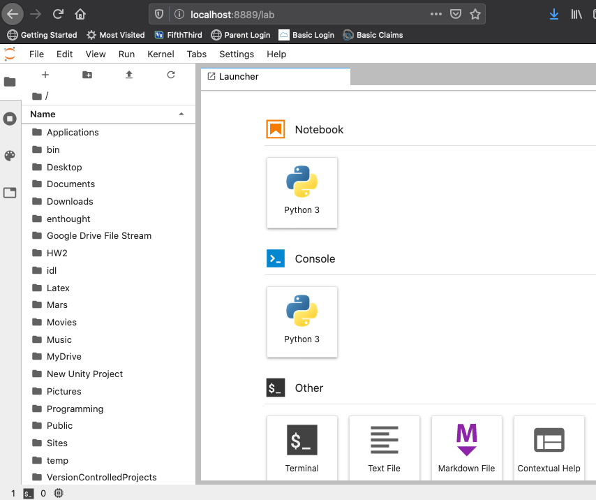

Good coding practices- Version control with git
======================================

For this week's good coding practices, the focus
is on maintaining and keeping track of changes
to your software as it evolves, also known as **version
control**. As you may have already discovered on your
own, the process of writing software is one of
write and revise, write and revise, repeat. As our
software becomes more complex, it becomes easier to make
changes to our code that cause unexpected issues,
in many cases without being aware that we've even
introduced such issues. Being able to go back and
look at a previous version of our software so that
we can fix such issues is paramount.

Additionally, when we work collaboratively on a project,
it is important to have a robust system that keeps track
of the changes that others make to software that is
used by the group. Otherwise it is difficult to
know what changes were made and easy to make mistakes
like overwrite updates to the code!
Simply put, keeping track of the changes that we make ourselves
or those that others make is an important part of programming
efficiently and effectively.

Git
---

As software development practices have evolved, so have
version control systems (VCS). One of the
most popular VCSs today is called git. Git handles
tracking changes made to files in a simple way,
without necessitating additional software to be installed
to each of your projects. Git handles all this by
essentially taking a snapshot of your entire project
each time you commit a change. In this way, git commits (each
individual snapshot) acts
kind of like a miniature file system. This means that
there are some really useful tools that make developing
software very efficient and safe, making it
difficult to destroy code.

If you have completed some of the previous exercises
in this course, you have used git without really
doing anything other than pressing an upload button or
two. Now we will learn to use git as part of
our normal workflow as part of working with Anaconda.

Installing git
^^^^^^^^^^^^^^

There are several ways to install git, but these instructions
will do so using the Anaconda Navigator. So, that
up as you normally would, but don't start a Spyder
session. Instead, once the Navigator is open,
launch a JupyterLab session. Once you click the
Launch button, you might be prompted to choose
a program with which to start a JupyerLab session.
Choose your favorite web browser.

    A JupyterLab session

We will talk more about using JupyterLab in a future
lesson, but here we will use it to access
the Terminal. You should see the terminal icon
in your JupyterLab startup under the "other" heading.
If not, you can click on `file` then `new` then `Terminal`.

    I use a mac, so my terminal might look a little
    different. On Windows, it will probably say
    something like "using Powershell".

This will start a terminal session within JupyterLab
itself. The terminal will behave differently
depending if you are on a Windows computer or a Mac,
but the command that we will use to install
git is the same regardless. In the terminal enter
the following command:

::

  conda install -c anaconda git

You will probably be told various things need updating,
and then prompted to enter whether to proceed or not.
Enter 'y' and git (and some other updates) will
be installed.

Using git
^^^^^^^^^

In this course, we will use git to

1. **Clone** (download) code from your remote repositories on GitHub.
2. Commit changes to your code on your local computer
   to maintain a history of the progress of your programs.
3. **Push** (upload) your commits back to the remote repository so
   they can be accessed from any other computer
   (and by me).

We will do these things by entering specific commands
in the terminal. First, a quick primer on how git
works.

Cloning
^^^^^^^
When you clone your github repository to your local machine, git will use three "trees" to manage your
project. The first one is your *working directory*,
which is simply the directory that contains your
actual files. The second tree is called the *index*
and is a staging area the keeps track of the files that
you are ready commit to your local repository, but haven't done so yet. The third tree is the *head* and it points at the last commit that you've made.

Let's clone one of your GitHub repositories. To do that, in the terminal enter:

::
  git clone link_to_remote_repository

where you need to replace "link_ro_remote_repository"
with the actual web address. You can find this by going to
the GitHub in the browser and navigating to your
repository there.

.. figure:: images/remoterepo.png
    :width: 600px
    :align: center
    :alt: a remote GitHub

    My exercise02 repo

You can get the link to the remote repository by clicking
on the 'Clone or Download' button. Copy that URL and
paste it in the terminal as part of the `git clone`
command. Hit enter and enter your GitHub credentials
if you are prompted for them.

This should result in a clone of your remote repository
on your local computer that is located in a directory
with the same name as your repository.

.. note:: When you clone your remote repo, it will be
          cloned to the current working directory on your local machine, the directory that you were
          in when you entered the clone command. If you
          didn't change directories, your cwd is
          probably your "home" directory.
          You can change directories in the
          terminal by using the
          `cd directoryname` command, and then clone
           to that directory if you want.

git workflow
^^^^^^^^^^^^

Once you have a clone of your code on your local computer,
you can modify those files as needed. Then,
you are ready to track your changes as part of the git
workflow. First, add files to the staging area. Next,
commit your code to your local repository.
Finally, push those commits to the remote repository
on GitHub. Using the terminal, the process is very straightforward.
The 3 commands that you need to do all of this:

::
  git add filename
  git commit -m 'message'
  git push origin master

The `git add` command will add the file called "filename"
to the index. You can use this command to add multiple
files over the course of a coding session. Again, the point of the index is to stage your commits so that
you can make changes to one file, at that file to the index,
and then work on a different file and not have to remember
what you were doing on that old file.

After you add one or more files to the index with
`git add` it is time to commit those changes to your
local repository using the `git commit` command.
You always want to include a message when making a commit
to let yourself and others know what changes you just
added to the project.

Finally, when you've made all of your commits and
are ready to upload the code to GitHub so you can share
it with others or be able to access your changes
from a different computer, it is time to
use the `git push origin master` command. This will
*push* the changes that you've made to your local
repository to your remote repository (on github).
In this context,
origin is a shorthand name for the remote repository
that your project was originally cloned from. Master
refers to the branch that you are pushing changes to
(branching is a special feature of git and it is
awesome, but we wont be using it in this course).

If all goes well, you should see a bunch of output
to the screen with a "Writing objects" 100%
in there somewhere. Then, you can see that
your changes have shown up on GitHub.

Git status
^^^^^^^^^^

Did you forget which files you've changed and which
you've added to the staging area? Did you
commit those changes that you were working on 2 hours
ago? These questions and more are answered by
the `git status` command. This command will tell
you what you've changed and what you still need to commit
so you always know where your files are at in the
git workflow. Use if often. But note, it will
not tell you if you've pushed changes to your remote
repository. You can 
