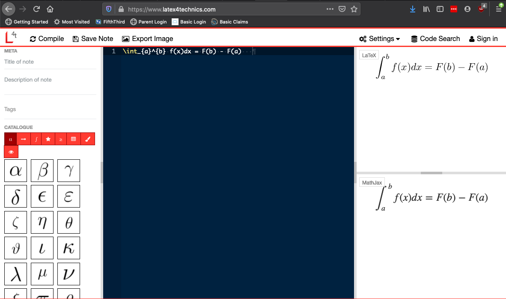

Math with Latex
===============

Let's switch gears for a second and learn a little about a
tool that is incredibly helpful for writing mathematical
expressions and formulae: Latex math mode. Latex (pronounced
lah-*teck*) is a document preparation system that
differs from software like Microsoft Word in that it is
not a what-you-see-is-what-you-get program. Instead,
Latex uses, for lack of a better word, commands to
help you build and format your documents. It is used
extensively in the academic and scientific fields
because Latex makes creating complex documents significantly
easier than typical word processing software.

Here, we are only going to learn about one aspect of
Latex: math mode. Latex math mode makes writing math
expressions very straightforward. Instead of relying
on a mouse-driven equation editor and is cumbersome,
math mode uses specific keystrokes to help create beautifully
formatted equations.

In order to get access to Latex math mode, you need
to download and install a complete Latex distriubtion
such as `MacTex (for Max) <http://www.tug.org/mactex/>`_
`MikTex (for Windows) <https://miktex.org/>`_. Then,
there are packages available that allow you to run math mode
only to produce equations that can be dragged and dropped
(copied and pasted) into another document (e.g. Word,
Powerpoint, etc.). For example, MacTex comes with
one such package called `LatexIt <https://www.chachatelier.fr/latexit/>`_.
Windows (and Mac) users can install `kLatexFormula <https://klatexformula.sourceforge.io/>`_.

Latex Math Mode in the browser
------------------------------

Maybe even better, there are several websites that
allow you to run Latex Math Mode from the browser, and
I recommend going that direction for now as installing
a full Latex distribution is more than we need at this point.
To get started, head over to `<https://www.latex4technics.com/>`_
which does everything we need it to.

  latex4technics landing page.

Once there, you should be greeted with a simple interface that
has 3 main panes: the sidebar "catalogue" which gives you mouse access
to a subset of the math mode "commands", the main latex math
text entry pane in the middle, and the output pane on the
right (there are two, but for all intents and purposes, they do the same thing). There is also a header bar at the top of the window with **compile**, **save** and **export image** options. The text entry pane may even already have a sample equation written for you.

This website works pretty simply. First you add text to the
text entry pane. When you are finished, you hit the
**compile** button. Then, your lovely equation should show up in the output window, assuming everything was entered correctly. Finally, you can either right click on the equation that is output and copy the image, or click the **export** button to save the image in a format of your choice (and the resolution of your choice). The hard part, if you can call it hard, is
figuring out what to enter.

Latex syntax
------------

The wonderful thing about Latex math mode is that the syntax
is meant to be extremely simple and intuitive.
Still, there is a lot that you can do and it can be difficult to remember some of the descriptions for different mathematical
operations. For that reason, the best resource that I've found
for everything math mode related is this wikibooks site:
`<https://en.wikibooks.org/wiki/LaTeX/Mathematics>`_.
This should be your go to resource for getting up and running.
For this reason, I will touch on just a few things here.

As you can see from the example, anything special that
you want to do needs to start with a backslash "\\". Think
of the backslash as a special character that initiates
a command. After the backslash is the command name. Again,
these are meant to be intuitive. Let's go ahead and
try a few in the text window in the browser.

For greek letters, it's simply the backslash and the
letter name: ``\rho``, ``\Delta``, ``\theta``, etc. As you
should find, if you start the greek word with a capital
letter, you get the capital greek letter. If you want to
do exponents, you use \^, as in ``x^n``. If the exponent
has more than 1 character, use {}: ``x^{n+1}``. Similarly,
subscripts are done with the underscore: ``y_{i-1}``.

Fractions are easy! Use the ``\frac`` command with two sets
of {}: 1 for the numerator and 1 for the denominator:
``\frac{x^5}{5!}``. Many special functions and
symbols use a shorthand notation. Examples include
square root: ``\sqrt{1+x}``, integrals and the infinity symbol:
``\int_0^\infty x^2 dx``. Derivatives can be written in a
couple forms: ``\frac{\partial E}{\partial x}`` gives us
partials and we can use ``\nabla\cdot E`` to use the del
operator (here with a dot product to give us
the divergence of E!).

Note that the catalogue gives you quick access to some
of the math mode functionality. However, I highly recommend
learning the keystrokes as it is much faster and more
efficient then messing around in those menus. Use the
catalogue as a way to get a quick reminder on the
math mode syntax if you forget something.  Also,
not all of the functionality of math mode is within
the catalogue.

Again, I'm not going to go into a ton of detail here.
My goal here is to introduce this tool and direct you to
resources that can help you use it, including the
`wikibooks site <https://en.wikipedia.org/wiki/LaTeX>`_. You will get some experience with math mode in an upcoming
exercise set. Beyond that, I hope that you will find
this useful when preparing documents for your physics and
math courses.
