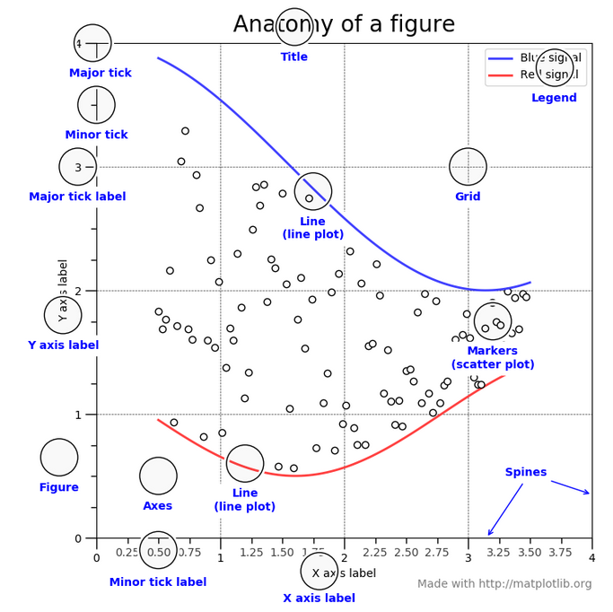

The Matplotlib Library
======================

Matplotlib is a expansive set of software tools that makes
it possible to produce quality figures as easily as possible.
The library packages together a suite of modules that enables us to
do things like create simple plots, make animations, interact with figures,
and save graphics in a variety of formats. The primary module that
we will work with directly, **pyplot**, provides a MatLAB-like
set of software tools that can be easily and quickly used to make
MatLAB-like line and surface plots, histograms, scatter plots and more.
The focus of the next couple lessons will be on learning how to create these
things with pyplot.

Anatomy of a Figure
-------------------

Before we dig into using pyplot, it is really helpful
to understand exactly what a figure is from a software
perspective. After all, our job as a developer is to create
meaningful graphics and to be able to do that in python, we
have to know what parts of a figure, plot, axis system, etc to modify.
Like everything in software, all the individual
pieces of a figure have a specific
set of characteristics that we are able to control.

First, let's look at the important visual components of a figure.

    Anatomy of a figure (from the Matplotlib docs)

Undoubtably you are already familiar with most of the different aspects
of a figure shown above. I want to make special note of a few things.
First, all of the things in blue in the image above are things that we can
manipulate. Obviously, we can control the lines and markers that are
plotted by changing the data that we are working with. Naturally, we
should be able to specify the axis labels, titles, and legends. We
also have full control over things like how many major tick marks to
use, how many minor ticks, whether either or both of those things
should have labels, how the plot is gridded, and how splines are used.
We can also control the characteristics of each of these plot elements,
from the text used in the labels, to the type of line used to
make the grid, to whether or not we want a box around the legend.
Generally, everything is customizable.

Additionally, you can see two other objects that can be modified: Figure
and Axes. I think it is useful to think about plotting in this way:
A **Figure** can contain one or more sets of **Axes** and an axis
can contain one or more plot types: **lines**, **markers**, **contour**, etc.
All of these things are *objects* in python and they can all be manipulated.
For example, let's say you want to create a line plot. To do so, first
you would create a ``Figure`` object. On that ``Figure``, you would add an ``Axis``.
Then on that ``Axis``, you would add your ``Line``.

It might seem like I'm being a bit pedantic here, but understanding this
organization is important because as you try to create interesting
graphics, you will have to learn to control these objects and their
properties. All that said, because the action of creating a ``Figure``
with an ``Axis`` and a ``Line`` (or scatter or contour, etc) is such a common task,
Matplotlib uses several shortcuts to make all this happen
 without requiring you to do it explicitly. For
example, if you use the ``pyplot.plot()`` function to
plot a line, a ``Figure`` and ``Axis`` will be created for you
automatically behind the scenes. This is nice because it
makes it easy to quickly create a line plot, but it can be confusing
if you want to do more complex things like make a line plot
that has two x-axes or something like that. For now, know that
whenever you plot something, even though you may not have
explicitly told python to create a ``Figure`` or ``Axis`` etc. object,
those objects do exist and you can modify them.

Matplotlib docs
---------------

In the next few lessons we will only scratch the surface of the
capabilities of Matplotlib. As typical, if you want to learn more
there is expansive documentation available online at `https://matplotlib.org/index.html`_
complete with many, many examples. One of the best ways to figure
out how to make a particular plot using Matplotlib is to find
an example online and start from there. The Matplotlib developers
know this and thus have created a beautiful gallery that has
all of these examples in one place: `https://matplotlib.org/gallery.html`_.
Be sure to visit the gallery to get a glimpse of the many different
things you can do with this powerful library and click on
one or more of the examples to see the code used to create it.
